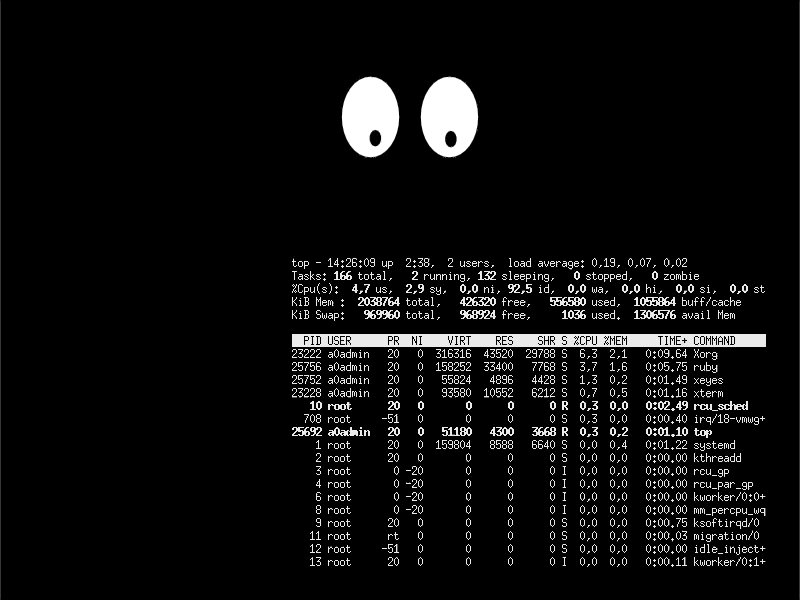

# Bouncing window manager

[Julia Evans](https://twitter.com/b0rk/status/1199158558362865665?s=20) window manager challenge.

## Install

1. You need ruby, I highly recommend [asdf](https://asdf-vm.com). Short instructions:
```
git clone https://github.com/asdf-vm/asdf.git ~/.asdf --branch v0.7.5
echo -e '\n. $HOME/.asdf/asdf.sh' >> ~/.bashrc
echo -e '\n. $HOME/.asdf/completions/asdf.bash' >> ~/.bashrc
asdf plugin-add ruby
# cd to this project folder where .tool-versions file is present
asdf install
```

2. Install required gems
```
bundle
```


## Run

```
bin/bouncywm
```

Just ALT + Click a window, to bounce a window. To stop it, ALT + Click it again.

## Demo


